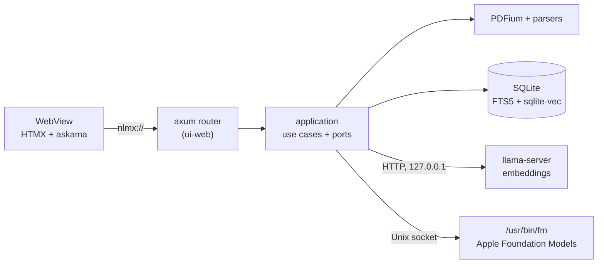

<p align="center">
  
</p>

<h1 align="center">NLMX</h1>

<p align="center">
  <strong>Use Apple Foundation Models locally, without being stuck in the terminal.</strong><br/>
  A simple, minimalist interface that puts Apple's local AI within everyone's reach.
</p>

<p align="center">
  English · <a href="README.pt-BR.md">Português</a>
</p>

<div align="center">

    [](https://github.com/faeliaso/NLMX/releases/latest) 

</div>

<p align="center">
  <a href="#features">Features</a> •
  <a href="#quick-start">Quick Start</a> •
  <a href="#architecture">Architecture</a> •
  <a href="#development">Development</a> •
  <a href="docs/README.md">Documentation</a> •
  <a href="#roadmap">Roadmap</a> •
  <a href="CONTRIBUTING.md">Contributing</a>
</p>

---

## What is NLMX?

NLMX is a native macOS app for **private document Q&A (local RAG)**. You import your documents, ask questions in natural language, and get answers grounded in those documents. Each answer carries numbered citations (`[1]`, `[2]`, …) that open the exact source: for a PDF, the page with the cited passage highlighted.

Extraction, indexing, search and answer generation all happen on the device. Documents, indexes and questions never leave your Mac, and after the one-time embedding-model download the app works offline. When the documents don't contain the answer, NLMX says so instead of inventing one.

It is built for people who work with many documents (standards, contracts, manuals, papers, technical docs) and cannot or do not want to send that content to the cloud.

## Why NLMX?

### The problem

Cloud chat-with-your-documents tools require uploading sensitive files. Self-hosted alternatives usually require Python, Docker or a local model server that you install and maintain yourself.

### The solution

- **Local-first**: the only network use is a model download that you start and confirm.
- **One `.dmg`, no extra runtime**: no Python, Ollama, Node or Docker in the shipped app.
- **Verifiable answers**: every document answer shows where it came from; low relevance yields "not found" without calling the model.
- **Native**: generation uses Apple Foundation Models through the system CLI `/usr/bin/fm`, so the app does not bundle a generative LLM.

## Features

### Library

- **Multi-format import**: PDF, Markdown, TXT, CSV/TSV, EPUB, DOCX and XLSX, several files at once, with background indexing and progress.
- **Notes**: paste text and index it as a source, with no file involved.
- **Deduplication**: SHA-256 content hash; re-importing a changed file updates the same document.
- **Removal without a trace**: deleting a document removes all derived data, including chat history that used it, and leaves no text in the database file ([ADR 0008](docs/adr/0008-document-removal.md)).

### Extraction and indexing

- **PDF via PDFium**: text per page with bounding boxes, repeated header/footer removal, de-hyphenation, headings and sections. Scanned PDFs are detected (`needs_ocr`).
- **Structure-aware chunking** per format, with provenance (page, section, row, character range, …) kept for every chunk.
- **Hybrid search**: BM25 (SQLite FTS5) and vector search (sqlite-vec) combined by weighted fusion ([ADR 0007](docs/adr/0007-weighted-hybrid-fusion.md)).
- **Resumable indexing** with a dedicated screen to retry, reindex and see what is pending.

### Chat

- **Free conversation** with Apple Foundation Models (the default), isolated from your library, or **answers from your documents** (all of them or one), streamed token by token.
- **Clickable citations**: `[n]` and `[page N]` open the PDF viewer beside the chat, or a source-details panel for other formats.
- **PDF viewer** with highlighted passage, text selection, search, zoom and thumbnails.
- **Saved conversations** with follow-up questions.

### Models

- Download embedding models with explicit confirmation, progress, checksum verification, activation and removal.

## Use cases

- Query a folder of contracts or standards and jump straight to the clause that supports the answer.
- Search a spreadsheet or CSV export in plain language.
- Ask questions about an EPUB, a manual or your own Markdown notes without uploading them anywhere.

## Requirements

### Required (to use the app)

- macOS 27 or later on Apple Silicon (no Intel, no Rosetta)
- Apple Intelligence enabled
- The `fm` license accepted once in Terminal with `sudo fm license`. The app never accepts it on your behalf.

### Required (to develop)

- Rust stable (pinned in [`rust-toolchain.toml`](rust-toolchain.toml), target `aarch64-apple-darwin`, MSRV 1.85)
- Tauri CLI: `cargo install tauri-cli`
- Xcode Command Line Tools: `xcode-select --install`

### Optional

- ImageMagick, only to regenerate app icons

## Installation

Pre-built releases are not published yet `[INFORMAÇÃO NECESSÁRIA: release/download URL]`. Build the installer yourself:

```sh
git clone git@github.com:faeliaso/NLMX.git
cd NLMX
make bootstrap   # Tailwind CLI, HTMX, PDFium, llama-server (once)
make bundle      # dist/NLMX.dmg, ad-hoc signed, then verified
```

1. Open `dist/NLMX.dmg` and drag **NLMX** to **Applications**.
2. Ad-hoc signed builds must be opened the first time with right-click › **Open**.
3. In the **Modelos** (Models) screen, download the embedding model. After that the app works offline.

Signed and notarized builds: `make release` (see [`docs/RELEASE.md`](docs/RELEASE.md)).

## Quick Start

Run from source in debug mode:

```sh
git clone git@github.com:faeliaso/NLMX.git
cd NLMX

make bootstrap                      # once
./scripts/fetch-embedding-model.sh  # optional: dev embedding model (~640 MB)
make dev                            # cargo tauri dev
```

To use the model fetched by the script without going through the Models screen:

```sh
NLMX_EMBEDDING_CONFIG=$PWD/models/embedding.json make dev
```

## Usage

1. **Documentos**: import files or add a note. Documents appear immediately as `queued` and move to `indexed`.
2. **Chat**: start a conversation. By default it is a free conversation with Apple Foundation Models. Change the scope to your documents (all or one) to get answers with sources.
3. Click a citation `[n]` to open the source. Use "Explique este documento." for an overview of a single document, or "seção N" to ask about a section.
4. **Indexação**: check index state, retry failures or reindex everything.
5. **Modelos**: manage embedding models.

The interface is in Brazilian Portuguese (pt-BR). A Portuguese question can find an English passage (multilingual embeddings).

## Configuration

| Variable / file | Required | Default | Description |
|---|---|---|---|
| `NLMX_EMBEDDING_CONFIG` | No | `<data>/embedding.json` | Path to the embedding-model config (see `models/embedding.example.json`) |
| `NLMX_PDFIUM_PATH` | No | `Contents/Frameworks`, then `runtime/lib` in debug | Location of the PDFium dylib |
| `NLMX_START_PATH` | No (debug builds only) | — | Start page, e.g. `/design-system?theme=dark` |

App data lives in `~/Library/Application Support/dev.nlmx.desktop/` (SQLite database, library, models, logs).

## Architecture

NLMX is a hexagonal Cargo workspace ([ADR 0001](docs/adr/0001-hexagonal-cargo-workspace.md)). The UI is HTML rendered by an in-process axum router, served to the WebView through a custom `nlmx://` protocol; there is no TCP listener.



**Answer flow:** question → hybrid retrieval → relevance gate (below the threshold, "not found" without calling the model) → context within a token budget → streamed generation → citations `[n]` mapped to document, location and passage.

Dependency rules (`domain` ← `application` ← `adapters/*` and `ui-web` ← `apps/desktop/src-tauri`) are enforced by `tests/tests/architecture.rs`. Details: [`docs/ARCHITECTURE.md`](docs/ARCHITECTURE.md).

## Tech Stack

| Layer | Technology |
|---|---|
| Desktop app | [Tauri 2](https://tauri.app) + Rust (edition 2024) |
| UI | [askama](https://github.com/askama-rs/askama) templates, [axum](https://github.com/tokio-rs/axum) router over `nlmx://` ([ADR 0003](docs/adr/0003-in-process-router-custom-protocol.md)), vendored [HTMX 4](https://htmx.org), [Tailwind CSS 4](https://tailwindcss.com) compiled at build time |
| PDF | [PDFium](https://pdfium.googlesource.com/pdfium/) (build 7881) via [pdfium-render](https://github.com/ajrcarey/pdfium-render) |
| Other formats | Dedicated parsers for Markdown/TXT/CSV, EPUB, DOCX and XLSX ([ADR 0011](docs/adr/0011-parser-layer.md), [0017](docs/adr/0017-docx-xlsx-without-viewer.md)) |
| Storage and search | [SQLite](https://sqlite.org) with FTS5 + [sqlite-vec](https://github.com/asg017/sqlite-vec), single database ([ADR 0004](docs/adr/0004-single-sqlite-store-fts5-sqlite-vec.md), [0005](docs/adr/0005-embedding-space-per-model.md)) |
| Embeddings | [llama.cpp](https://github.com/ggml-org/llama.cpp) (`llama-server` b11349) with Qwen3-Embedding-0.6B (GGUF) |
| Generation | Apple Foundation Models via `/usr/bin/fm`, no Swift ([ADR 0002](docs/adr/0002-fm-cli-serve-over-uds.md)) |

## Privacy

- Documents and questions **never leave the device**. The only network access is a model download, always started by you.
- No TCP listeners, with one exception: the supervised `llama-server` listens on `127.0.0.1` only, on an ephemeral port, with a per-run API key ([ADR 0006](docs/adr/0006-llama-server-loopback.md)).
- No telemetry is sent anywhere. Logs are local JSON lines and never contain document text, chunks, questions, answers, prompts, titles, file names or user paths; a redaction layer is a safety net, and log changes are reviewed by hand.

## Project Structure

```text
apps/desktop/          Tauri app: src-tauri/ (composition root, commands) and ui/ (templates, styles, scripts)
crates/
  domain/              pure types and rules
  application/         use cases and all ports
  adapters/            pdf-pdfium, store-sqlite, embed-llama, llm-fm, models-catalog, parsers, chunkers, …
  ui-web/              axum router and page rendering
  testing/             in-memory fakes and port contract suites
tests/                 architecture, model activation and release acceptance tests
scripts/               bootstrap, bundle, verification, acceptance, icons
docs/                  product, architecture, design system, testing, release, ADRs
```

## Development

| Command | What it does |
|---|---|
| `make bootstrap` | Downloads build tools and runtime: Tailwind CLI, HTMX 4, PDFium, `llama-server` |
| `make dev` | Runs the app in debug mode (`cargo tauri dev`) |
| `make build` | Builds the workspace |
| `make test` · `test-unit` · `test-integration` | Tests that need no real model, and subsets |
| `make lint` · `make fmt` | `cargo fmt --check` + `clippy -D warnings` · formatting |
| `make bundle` | Builds `dist/NLMX.dmg` (ad-hoc signed) and verifies it |
| `make release` | Developer ID signed and notarized DMG |
| `make acceptance` | Installs the DMG in a temp environment and verifies it end to end (downloads the model, ~640 MB) |
| `./scripts/make-icons.sh` | Regenerates app icons from `icons/source.png` |

Run a single test: `cargo test -p nlmx-parser-text paragraphs`. More in [`docs/TESTING.md`](docs/TESTING.md).

## Contributing

Contributions are welcome. Branch from `develop` (`feature/…`; see [docs/CI.md](docs/CI.md)), keep changes small and tested, run `make lint` and `make test`, and open the pull request against `develop` (`main` only receives releases). Read [CONTRIBUTING.md](CONTRIBUTING.md) for the architecture, privacy and database rules. Architectural decisions go in a new ADR under [`docs/adr/`](docs/adr/).

## Roadmap

Status of every requirement is in [`docs/PRODUCT.md`](docs/PRODUCT.md).

| Item | Status |
|---|---|
| PDF, Markdown, TXT, CSV, EPUB, DOCX, XLSX, notes | Done |
| Hybrid search, cited chat, PDF viewer, model management | Done |
| OCR for scanned PDFs (e.g. `fm respond --tool ocr`) | Planned |

Out of scope: Intel/Windows/Linux, alternative generative LLMs, reranker, sync, PDF annotation, Mac App Store.

## Documentation

The documentation in `docs/` is written in Portuguese.

| Document | Content |
|---|---|
| [`docs/PRODUCT.md`](docs/PRODUCT.md) | Vision, requirements with status, targets, risks |
| [`docs/ARCHITECTURE.md`](docs/ARCHITECTURE.md) | Layers, ports, flows, processes, database |
| [`docs/DESIGN_SYSTEM.md`](docs/DESIGN_SYSTEM.md) | Tokens, components, accessibility |
| [`docs/TESTING.md`](docs/TESTING.md) | Test suites, metrics, logs |
| [`docs/RELEASE.md`](docs/RELEASE.md) | DMG, signing, notarization, checklist |
| [`docs/adr/`](docs/adr/) | Architecture decision records |

## Support

Open an issue at [github.com/faeliaso/NLMX/issues](https://github.com/faeliaso/NLMX/issues). Include the NLMX and macOS versions, your Mac model, reproduction steps and, if relevant, excerpts from `~/Library/Application Support/dev.nlmx.desktop/logs/nlmx.jsonl`. **Do not attach private documents.**

## License

MIT License. See [LICENSE](LICENSE).

The app bundles third-party components under their own licenses (PDFium, llama.cpp, SQLite, sqlite-vec). Their texts are in [`apps/desktop/src-tauri/licenses/`](apps/desktop/src-tauri/licenses/) and ship with the installed app.

## Acknowledgements

[PDFium](https://pdfium.googlesource.com/pdfium/) and [pdfium-render](https://github.com/ajrcarey/pdfium-render), [llama.cpp](https://github.com/ggml-org/llama.cpp), [sqlite-vec](https://github.com/asg017/sqlite-vec), [Tauri](https://tauri.app), [HTMX](https://htmx.org), [Tailwind CSS](https://tailwindcss.com), and the Qwen3-Embedding model.
