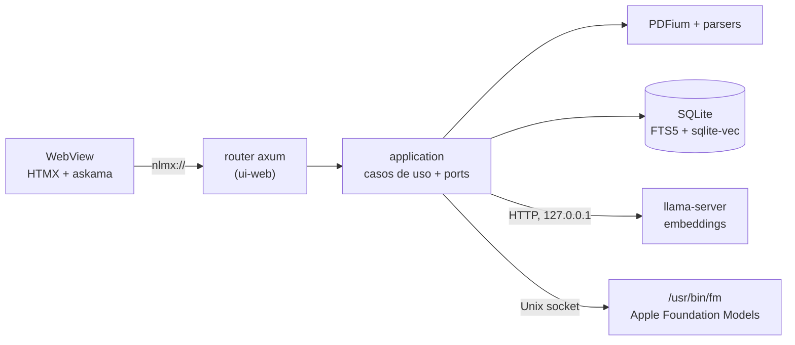

<p align="center">
  
</p>

<h1 align="center">NLMX</h1>

<p align="center">
  <strong>Use o Apple Foundation Models localmente, sem ficar preso ao terminal.</strong><br/>
  Uma interface simples e minimalista para colocar a IA local da Apple ao alcance de todos.
</p>

<p align="center">
  <a href="README.md">English</a> · Português
</p>

<div align="center">

     

</div>

<p align="center">
  <a href="#funcionalidades">Funcionalidades</a> •
  <a href="#início-rápido">Início rápido</a> •
  <a href="#arquitetura">Arquitetura</a> •
  <a href="#desenvolvimento">Desenvolvimento</a> •
  <a href="docs/README.md">Documentação</a> •
  <a href="#roadmap">Roadmap</a> •
  <a href="CONTRIBUTING.md">Contribuição</a>
</p>

---

## O que é o NLMX?

O NLMX é um app nativo para macOS para **perguntas e respostas privadas sobre documentos (RAG local)**. Você importa seus documentos, faz perguntas em linguagem natural e recebe respostas fundamentadas neles. Cada resposta traz citações numeradas (`[1]`, `[2]`, …) que abrem a fonte exata: num PDF, a página com o trecho citado destacado.

Extração, indexação, busca e geração das respostas acontecem no próprio dispositivo. Documentos, índices e perguntas nunca saem do Mac, e depois do download único do modelo de embeddings o app funciona offline. Quando os documentos não têm a resposta, o NLMX diz isso em vez de inventar uma.

Foi feito para quem lida com muitos documentos (normas, contratos, manuais, artigos, documentação técnica) e não pode ou não quer enviar esse conteúdo para a nuvem.

## Por que o NLMX?

### O problema

Ferramentas de "chat com seus documentos" na nuvem exigem enviar arquivos sensíveis. As alternativas auto-hospedadas costumam exigir Python, Docker ou um servidor de modelos que você mesmo instala e mantém.

### A solução

- **Local-first**: o único uso de rede é o download de um modelo, que você inicia e confirma.
- **Um `.dmg`, sem runtime extra**: sem Python, Ollama, Node ou Docker no app distribuído.
- **Respostas verificáveis**: toda resposta com documentos mostra de onde veio; relevância baixa resulta em "não encontrei" sem chamar o modelo.
- **Nativo**: a geração usa o Apple Foundation Models pelo CLI do sistema `/usr/bin/fm`, então o app não embarca um LLM gerador.

## Funcionalidades

### Biblioteca

- **Importação multiformato**: PDF, Markdown, TXT, CSV/TSV, EPUB, DOCX e XLSX, vários arquivos de uma vez, com indexação em segundo plano e progresso.
- **Notas**: cole um texto e indexe-o como fonte, sem arquivo.
- **Deduplicação**: hash SHA-256 do conteúdo; reimportar um arquivo alterado atualiza o mesmo documento.
- **Remoção sem rastro**: remover um documento apaga todos os dados derivados, inclusive o histórico de chat que o usou, e não deixa texto no arquivo do banco ([ADR 0008](docs/adr/0008-document-removal.md)).

### Extração e indexação

- **PDF via PDFium**: texto por página com bounding boxes, remoção de cabeçalhos e rodapés repetidos, junção de palavras hifenizadas, títulos e seções. PDFs escaneados são detectados (`needs_ocr`).
- **Chunking por estrutura** para cada formato, com a origem (página, seção, linha, intervalo de caracteres, …) guardada em cada chunk.
- **Busca híbrida**: BM25 (SQLite FTS5) e busca vetorial (sqlite-vec) combinadas por fusão ponderada ([ADR 0007](docs/adr/0007-weighted-hybrid-fusion.md)).
- **Indexação retomável**, com tela própria para tentar de novo, reindexar e ver o que está pendente.

### Chat

- **Conversa livre** com o Apple Foundation Models (padrão), isolada da biblioteca, ou **respostas a partir dos documentos** (todos ou um), em streaming.
- **Citações clicáveis**: `[n]` e `[página N]` abrem o visualizador de PDF ao lado do chat, ou um painel de informações da fonte para os outros formatos.
- **Visualizador de PDF** com destaque do trecho, seleção de texto, busca, zoom e miniaturas.
- **Conversas salvas**, com perguntas de acompanhamento.

### Modelos

- Download de modelos de embeddings sob confirmação explícita, com progresso, verificação de checksum, ativação e remoção.

## Casos de uso

- Consultar uma pasta de contratos ou normas e ir direto à cláusula que sustenta a resposta.
- Pesquisar uma planilha ou exportação CSV em linguagem natural.
- Tirar dúvidas sobre um EPUB, um manual ou suas notas em Markdown sem enviá-los a lugar nenhum.

## Requisitos

### Obrigatórios (para usar o app)

- macOS 27 ou superior em Apple Silicon (sem Intel, sem Rosetta)
- Apple Intelligence ativo
- A licença do `fm` aceita uma vez no Terminal com `sudo fm license`. O app nunca a aceita por você.

### Obrigatórios (para desenvolver)

- Rust stable (fixado em [`rust-toolchain.toml`](rust-toolchain.toml), alvo `aarch64-apple-darwin`, MSRV 1.85)
- Tauri CLI: `cargo install tauri-cli`
- Xcode Command Line Tools: `xcode-select --install`

### Opcionais

- ImageMagick, só para regenerar os ícones

## Instalação

Ainda não há releases publicadas `[INFORMAÇÃO NECESSÁRIA: URL de release/download]`. Gere o instalador você mesmo:

```sh
git clone git@github.com:faeliaso/NLMX.git
cd NLMX
make bootstrap   # Tailwind CLI, HTMX, PDFium, llama-server (uma vez)
make bundle      # dist/NLMX.dmg, assinatura ad-hoc, com verificação
```

1. Abra `dist/NLMX.dmg` e arraste o **NLMX** para **Aplicativos**.
2. Builds com assinatura ad-hoc precisam ser abertas pela primeira vez com clique direito › **Abrir**.
3. Na tela **Modelos**, baixe o modelo de embeddings. Depois disso o app funciona offline.

Builds assinadas e notarizadas: `make release` (veja [`docs/RELEASE.md`](docs/RELEASE.md)).

## Início rápido

Rodar a partir do código-fonte, em modo debug:

```sh
git clone git@github.com:faeliaso/NLMX.git
cd NLMX

make bootstrap                      # uma vez
./scripts/fetch-embedding-model.sh  # opcional: modelo de embeddings de desenvolvimento (~640 MB)
make dev                            # cargo tauri dev
```

Para usar o modelo baixado pelo script sem passar pela tela Modelos:

```sh
NLMX_EMBEDDING_CONFIG=$PWD/models/embedding.json make dev
```

## Uso

1. **Documentos**: importe arquivos ou adicione uma nota. Os documentos aparecem na hora como `queued` e passam a `indexed`.
2. **Chat**: inicie uma conversa. Por padrão é uma conversa livre com o Apple Foundation Models. Mude o escopo para os documentos (todos ou um) para receber respostas com fontes.
3. Clique numa citação `[n]` para abrir a fonte. Use "Explique este documento." para uma visão geral de um documento, ou "seção N" para perguntar sobre uma seção.
4. **Indexação**: veja o estado do índice, tente de novo as falhas ou reindexe tudo.
5. **Modelos**: gerencie os modelos de embeddings.

A interface está em português do Brasil. Uma pergunta em português encontra um trecho em inglês (embeddings multilíngues).

## Configuração

| Variável / arquivo | Obrigatória | Padrão | Descrição |
|---|---|---|---|
| `NLMX_EMBEDDING_CONFIG` | Não | `<data>/embedding.json` | Caminho da configuração do modelo de embeddings (veja `models/embedding.example.json`) |
| `NLMX_PDFIUM_PATH` | Não | `Contents/Frameworks`, depois `runtime/lib` em debug | Local da dylib do PDFium |
| `NLMX_START_PATH` | Não (só builds debug) | — | Página inicial, ex.: `/design-system?theme=dark` |

Os dados do app ficam em `~/Library/Application Support/dev.nlmx.desktop/` (banco SQLite, biblioteca, modelos, logs).

## Arquitetura

O NLMX é um workspace Cargo hexagonal ([ADR 0001](docs/adr/0001-hexagonal-cargo-workspace.md)). A interface é HTML renderizado por um router axum em processo, entregue à WebView por um protocolo customizado `nlmx://`; não há listener TCP.



**Fluxo de uma resposta:** pergunta → busca híbrida → filtro de relevância (abaixo do limite, "não encontrei" sem chamar o modelo) → contexto dentro de um orçamento de tokens → geração em streaming → citações `[n]` ligadas a documento, localização e trecho.

As regras de dependência (`domain` ← `application` ← `adapters/*` e `ui-web` ← `apps/desktop/src-tauri`) são verificadas por `tests/tests/architecture.rs`. Detalhes: [`docs/ARCHITECTURE.md`](docs/ARCHITECTURE.md).

## Tecnologias

| Camada | Tecnologia |
|---|---|
| App desktop | [Tauri 2](https://tauri.app) + Rust (edition 2024) |
| Interface | Templates [askama](https://github.com/askama-rs/askama), router [axum](https://github.com/tokio-rs/axum) sobre `nlmx://` ([ADR 0003](docs/adr/0003-in-process-router-custom-protocol.md)), [HTMX 4](https://htmx.org) vendorizado, [Tailwind CSS 4](https://tailwindcss.com) compilado no build |
| PDF | [PDFium](https://pdfium.googlesource.com/pdfium/) (build 7881) via [pdfium-render](https://github.com/ajrcarey/pdfium-render) |
| Outros formatos | Parsers dedicados para Markdown/TXT/CSV, EPUB, DOCX e XLSX ([ADR 0011](docs/adr/0011-parser-layer.md), [0017](docs/adr/0017-docx-xlsx-without-viewer.md)) |
| Armazenamento e busca | [SQLite](https://sqlite.org) com FTS5 + [sqlite-vec](https://github.com/asg017/sqlite-vec), em um único banco ([ADR 0004](docs/adr/0004-single-sqlite-store-fts5-sqlite-vec.md), [0005](docs/adr/0005-embedding-space-per-model.md)) |
| Embeddings | [llama.cpp](https://github.com/ggml-org/llama.cpp) (`llama-server` b11349) com Qwen3-Embedding-0.6B (GGUF) |
| Geração | Apple Foundation Models pelo `/usr/bin/fm`, sem Swift ([ADR 0002](docs/adr/0002-fm-cli-serve-over-uds.md)) |

## Privacidade

- Documentos e perguntas **nunca saem do dispositivo**. O único acesso à rede é o download de um modelo, sempre iniciado por você.
- Sem listeners TCP, com uma exceção: o `llama-server` supervisionado escuta só em `127.0.0.1`, numa porta efêmera e com chave por execução ([ADR 0006](docs/adr/0006-llama-server-loopback.md)).
- Nenhuma telemetria é enviada. Os logs são JSON lines locais e nunca contêm texto de documentos, chunks, perguntas, respostas, prompts, títulos, nomes de arquivo ou caminhos do usuário; uma camada de redação serve de rede de segurança e mudanças em logs são revisadas à mão.

## Estrutura do repositório

```text
apps/desktop/          app Tauri: src-tauri/ (composition root, comandos) e ui/ (templates, estilos, scripts)
crates/
  domain/              tipos e regras puras
  application/         casos de uso e todos os ports
  adapters/            pdf-pdfium, store-sqlite, embed-llama, llm-fm, models-catalog, parsers, chunkers, …
  ui-web/              router axum e renderização das páginas
  testing/             fakes em memória e suítes de contrato dos ports
tests/                 testes de arquitetura, ativação de modelo e aceitação de release
scripts/               bootstrap, bundle, verificação, aceitação e ícones
docs/                  produto, arquitetura, design system, testes, release e ADRs
```

## Desenvolvimento

| Comando | O que faz |
|---|---|
| `make bootstrap` | Baixa as ferramentas de build e o runtime: Tailwind CLI, HTMX 4, PDFium, `llama-server` |
| `make dev` | Roda o app em modo debug (`cargo tauri dev`) |
| `make build` | Compila o workspace |
| `make test` · `test-unit` · `test-integration` | Testes que não precisam de modelo real, e subconjuntos |
| `make lint` · `make fmt` | `cargo fmt --check` + `clippy -D warnings` · formatação |
| `make bundle` | Gera `dist/NLMX.dmg` (assinatura ad-hoc) e verifica |
| `make release` | DMG assinado com Developer ID e notarizado |
| `make acceptance` | Instala o DMG num ambiente temporário e verifica de ponta a ponta (baixa o modelo, ~640 MB) |
| `./scripts/make-icons.sh` | Regenera os ícones a partir de `icons/source.png` |

Rodar um teste isolado: `cargo test -p nlmx-parser-text paragraphs`. Mais em [`docs/TESTING.md`](docs/TESTING.md).

## Contribuição

Contribuições são bem-vindas. Crie a branch a partir de `develop` (`feature/…`; veja [docs/CI.md](docs/CI.md)), faça mudanças pequenas e testadas, rode `make lint` e `make test`, e abra o pull request para `develop` (a `main` recebe só releases). Leia o [CONTRIBUTING.md](CONTRIBUTING.md) para as regras de arquitetura, privacidade e banco de dados. Decisões de arquitetura vão num novo ADR em [`docs/adr/`](docs/adr/).

## Roadmap

O status de cada requisito está em [`docs/PRODUCT.md`](docs/PRODUCT.md).

| Item | Status |
|---|---|
| PDF, Markdown, TXT, CSV, EPUB, DOCX, XLSX, notas | Feito |
| Busca híbrida, chat com citações, visualizador de PDF, gestão de modelos | Feito |
| OCR de PDFs escaneados (ex.: `fm respond --tool ocr`) | Planejado |

Fora de escopo: Intel/Windows/Linux, LLM gerador alternativo, reranker, sincronização, anotação de PDFs, Mac App Store.

## Documentação

| Documento | Conteúdo |
|---|---|
| [`docs/PRODUCT.md`](docs/PRODUCT.md) | Visão, requisitos com status, metas e riscos |
| [`docs/ARCHITECTURE.md`](docs/ARCHITECTURE.md) | Camadas, ports, fluxos, processos e banco |
| [`docs/DESIGN_SYSTEM.md`](docs/DESIGN_SYSTEM.md) | Tokens, componentes e acessibilidade |
| [`docs/TESTING.md`](docs/TESTING.md) | Suítes de teste, métricas e logs |
| [`docs/RELEASE.md`](docs/RELEASE.md) | DMG, assinatura, notarização e checklist |
| [`docs/adr/`](docs/adr/) | Decisões de arquitetura |

## Suporte

Abra uma issue em [github.com/faeliaso/NLMX/issues](https://github.com/faeliaso/NLMX/issues). Informe as versões do NLMX e do macOS, o modelo do Mac, os passos para reproduzir e, se relevante, trechos de `~/Library/Application Support/dev.nlmx.desktop/logs/nlmx.jsonl`. **Não anexe documentos privados.**

## Licença

Licença MIT. Veja [LICENSE](LICENSE).

O app inclui componentes de terceiros com licenças próprias (PDFium, llama.cpp, SQLite e sqlite-vec). Os textos dessas licenças estão em [`apps/desktop/src-tauri/licenses/`](apps/desktop/src-tauri/licenses/) e acompanham o app instalado.

## Agradecimentos

[PDFium](https://pdfium.googlesource.com/pdfium/) e [pdfium-render](https://github.com/ajrcarey/pdfium-render), [llama.cpp](https://github.com/ggml-org/llama.cpp), [sqlite-vec](https://github.com/asg017/sqlite-vec), [Tauri](https://tauri.app), [HTMX](https://htmx.org), [Tailwind CSS](https://tailwindcss.com) e o modelo Qwen3-Embedding.
